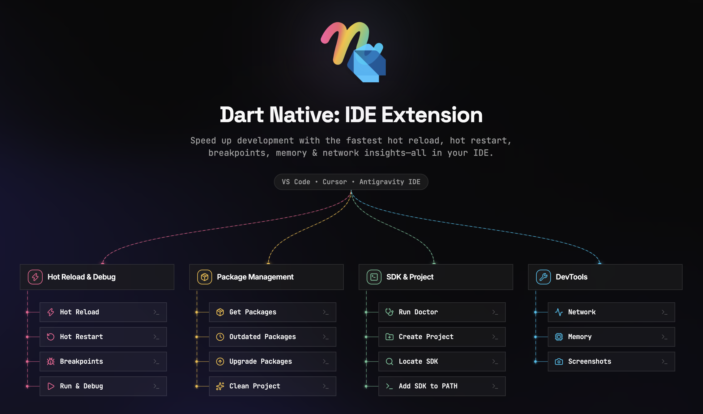

  

## Introduction

This extension provides tools for
effectively editing, refactoring, running, and debugging [Dart Native](https://dartnative.com/)
mobile apps.

## Features

- Edit and Debug DartNative mobile apps (launch using `F5` or the `Debug` menu)
- Automatic hot reloads for DartNative
- Refactorings and Code fixes
- Quickly switch between devices for DartNative
- DartNative Doctor command
- DartNative Get Packages command
- DartNative Upgrade Packages command
- Automatically gets packages when `pubspec.yaml` is saved
- Automatically finds SDKs from `PATH`
- Notification of new stable Dart SDK releases
- Sort Members command
- Support for debugging "just my code" or SDK/libraries too ([`dart.debugSdkLibraries`] and [`dart.debugExternalPackageLibraries`])
- Prompts to get packages when out of date
- Syntax highlighting
- Code completion
- Snippets
- Realtime errors/warnings/TODOs
- Documentation in hovers/tooltips
- Go to Definition
- Find References
- Rename refactoring
- Format document
- Support for format-on-save (`editor.formatOnSave`)
- Support for format-on-type (`editor.formatOnType`)
- Workspace symbol search
- Document symbol search
- Organize Imports command
- Pub Get Packages command
- Pub Upgrade Packages command
- Type Hierarchy
